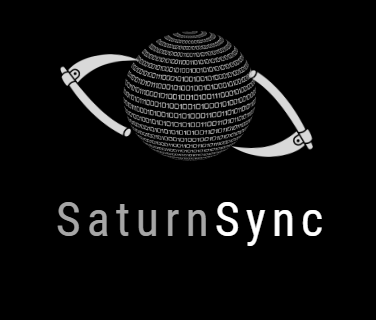

<p align="center">
  
</p>

# SaturnSync Web Scraper

Този Python скрипт ви позволява да извличате текстова информация и URL адреси на изображения от уебсайт и предоставя опции за запазване на данните в различни формати.

## Примерни входни данни за скрипта:

```plaintext
Enter the website URL: https://www.example.com

Text Data:
Lorem ipsum dolor sit amet, consectetur adipiscing elit.
Vestibulum eget ipsum vitae massa placerat feugiat.
Nunc eget ligula vel neque consequat dignissim.

Image URLs:
https://www.example.com/images/image1.jpg
https://www.example.com/images/image2.jpg

Save the data to a file? Enter 'txt', 'word', or 'none': txt
Enter the file path to save the TXT file: C:/path/to/save/data.txt
Data saved to TXT file: C:/path/to/save/data.txt

## Функционалности

- Извлича текстова информация от зададения уебсайт и я сортира в параграфи.
- Извлича URL адреси на изображения от уебсайта.
- Показва извлечените текстови данни и URL адреси на изображенията.
- Предлага опции за запазване на данните в TXT файл или Word файл.

## Използване

1. Клонирайте хранилището или изтеглете файла `web_scraper.py` на вашия компютър.

2. Инсталирайте необходимите библиотеки:
- `pip install requests`
- `pip install beautifulsoup4`
- `pip install python-docx`
   
3. Изпълнете скрипта:
   python web_scraper.py

4. Въведете желания URL адрес на уебсайта, когато ви бъде поискано.

5. Скриптът ще извлече данните от уебсайта и ще ги покаже - текстовите данни и URL адресите на изображенията.

6. Изберете дали да запазите данните, като въведете една от следните опции: 'txt', 'word' или 'none'.
- Ако изберете 'txt', посочете пътя към файл, където да запазите данните като TXT файл.
- Ако изберете 'word', посочете пътя към файл, където да запазите данните като Word файл.
- Ако изберете 'none', данните няма да бъдат запазени.

7. Скриптът ще запази данните на посочения път, ако сте го избрали.

## Изисквания

- Python 3.x
- Библиотека Requests
- Библиотека BeautifulSoup
- Библиотека python-docx (`pip install python-docx`)

## Лиценз

Този проект е лицензиран под [MIT лиценз](LICENSE).